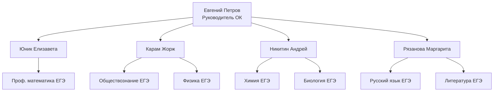

---
{"dg-publish":true,"permalink":"/100-ballnyj-repetitor/personalii/komanda-ok/komanda-ok/","tags":["#read_me"]}
---

# 👥 Команда ОК

Основная команда Отдела кураторов и тимлидов, отвечающих за различные учебные направления.

---

## 🎯 Руководство

**Руководитель Отдела кураторов:**  
### 👑 [[100Балльный репетитор/Персоналии/Команда ОК/Команда ОК\|Петров Евгений]]

---

## 🚂 Тимлиды

### 👔 [[100Балльный репетитор/Персоналии/Команда ОК/Юник Елизавета\|Юник Елизавета]]
- *Тимлид направления "Профильная математика ЕГЭ с Ильичом"*
- *Руководитель отдела репетиторов*

### 👔 [[100Балльный репетитор/Персоналии/Команда ОК/Карам Жорж\|Карам Жорж]]
- *Тимлид направления "Обществознание ЕГЭ с Валентинычем"*
- *Тимлид направления "Физика ЕГЭ"*

### 👔 [[100Балльный репетитор/Персоналии/Команда ОК/Никитин Андрей\|Никитин Андрей]]
- *Тимлид направления "Химия ЕГЭ с Катей"*
- *Тимлид направления "Химия ЕГЭ с Олей"* 
- *Тимлид направления "Биология ЕГЭ с Ксенией"*
- *Тимлид направления "Биология ЕГЭ с Мариной"* 

### 👔 [[100Балльный репетитор/Персоналии/Команда ОК/Рязанова Маргарита\|Рязанова Маргарита]]
- *Тимлид направления "Русский язык ЕГЭ"*
- *Тимлид направления "Литература ЕГЭ"*

---

## 📊 Структура подчинения

